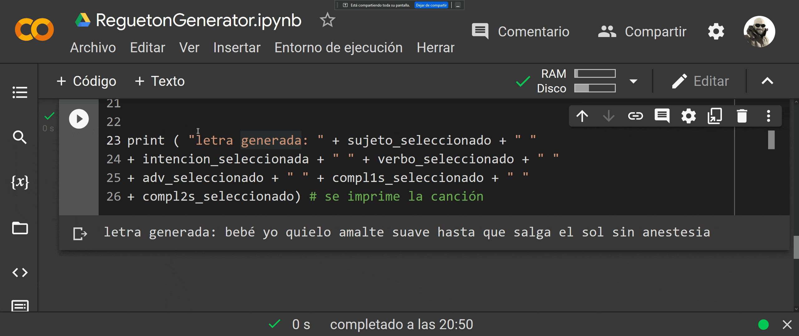

# Ejercicios

# Ejercicio 1

## Mi primer programa en :snake:

¿Cómo hacer un regueton?

En este ejercicio Don Milquiades nos va a dar la pauta para componer letras de regueton, lo cuál codificaremos y desarrollaremos una maquina de hacer letras de regueton.

|||||||
|-|-|-|-|-|-|
|Mami|Yo Quiero|Encendelte|Suave|Hasta que salga el sol|Sin anestesia|
|Bebé|Yo Puedo|Amalte|Lento|Toda la Noche|sin compromiso|
|Princess|Yo Vengo a|Ligal|lápido|Hasta el amanecel|Feis to feis|
|Mami|Voy a|Jugal|fuelte|Todo el día|Sin miedo|

### Desarrollo:

```python
from IPython.display import YouTubeVideo
YouTubeVideo("6iOlB0QLy84")
```

```python
import random # se importa la librería de python random
sujetos = ["mami", "bebé", " princess" , "mami"]    # se define una lista  
intenciones = ["yo quielo" , "yo puedo", "yo vengo a" , "voy a" ]
verbos = [ "encendelte" , "amalte", " ligal " , " jugal" ] 
advs = [ "suave" , " lento" , "lápido", " fuelte" ]
complementos_uno = [ "hasta que salga el sol" , "toda la noche",  
"hasta el amanecel", "todo el día"]
complementos_dos = [ "sin anestesia" , "sin compromiso", " feis to feis" ,  
"sin miedo"]

sujeto_seleccionado = random.choice( sujetos)
# se u t i l i z a la l i br er í a 
intencion_seleccionada = random.choice(intenciones)
# para s el ec c i onar un elemento
verbo_seleccionado = random.choice(verbos)
# al azar de la l i s t a s uj et os
adv_seleccionado = random.choice(advs) 
compl1s_seleccionado = random.choice(complementos_uno)
compl2s_seleccionado = random.choice(complementos_dos)


print ( "letra generada: " + sujeto_seleccionado + " "
+ intencion_seleccionada + " " + verbo_seleccionado + " "
+ adv_seleccionado + " " + compl1s_seleccionado + " "
+ compl2s_seleccionado) # se imprime la canción
```


# Ejercicio 2

Elabore un generador de discurso político al azar, basado en fráses de cajón.

### Desarrollo:

Se generará a partir de estas entradas que conforman un conjunto de frases de cajón muy habituales en los políticos colombianos.

|Lambetazo|Potenciales Marranos|Condición|Compromiso|Ilusión|Promesa|Beneficio populista|Dependiendo de la cantidad de votos|
|:-:|:-:|:-:|:-:|:-:|:-:|:-:|:-:|
|Colombianos y queridos|olvidados por la élite|durante nuestro mandato|vamos a derrotar a|la violencia que nos acaba y|mejoraré la economía empobrecida para|la educación|del país.|
|Mi querido pueblo y mis queridos|conciudadanos|en mi próximo período de gobierno|vamos a opacar a|la economía mediocre y|trabajaré muy duro por|los niños pobres y los olvidados|del pueblo.|
|Distinguidísimos y amadísimos|amigos|durante el gobierno del pueblo|vamos a sepultar a|las élites que nos oprimen y|me esforzaré con mi alma y mi amor por|la paz|de la ciudadanía olvidada.|
|Honorables y queridísimos|coterraneos|en estos próximo cuatro añoss|venceremos con el amor a|las mafias corruptas y|me entregaré en cuerpo y alma por|el futuro|de la nación.|
|Estimados y benignísimos|compatriotas|en el gobierno del orden|reestructurarémos el país para mejorar a|la falta de democrácia y|uniré a todos los partidos y fuerzas politicas para trabajar por|la salud maltrecha|de todos y cada uno de ustedes.|
|Respetados y bondadosos|electores|en la implementación de la verdadera democracia|harémos pagar a|los delincuentes en la política y las calles y|lucharemos incansablemente y a cada instante de mi gobierno por|la economía|de mis queridos colombianos.|

Desarrollo:

```python
import random # se importa la librería de python random
#Selecciones
lambetazo = ["Colombianos y queridos","Mi querido pueblo y mis queridos", "Distinguidísimos y amadísimos", "Honorables y queridísimos", "Estimados y benignísimos", "Respetados y bondadosos"]    # se definen las listas
marranos = ["olvidados por la élite,", "conciudadanos,", "amigos,", "coterraneos,", "compatriotas,", "electores," ]
condicion = ["durante nuestro mandato", "en mi próximo período de gobierno", "durante el gobierno del pueblo","en estos próximo cuatro años","en el gobierno del orden", "en la implementación de la verdadera democracia"  ] 
compromiso = ["vamos a derrotar a", "vamos a opacar a", "vamos a sepultar a", "venceremos con el amor a", "reestructurarémos el país para mejorar a", "harémos pagar a"]
ilusion = ["la violencia que nos acaba y", "la economía mediocre y", "las élites que nos oprimen y", "las mafias corruptas y", "la falta de democrácia y", "los delincuentes en la política y las calles y" ]
promesa = ["mejoraré la economía empobrecida para", "trabajaré muy duro por", "me esforzaré con mi alma y mi amor por", "me entregaré en cuerpo y alma por", "uniré a todos los partidos y fuerzas politicas para trabajar por", "lucharemos incansablemente y a cada instante de mi gobierno por"]
beneficio_pop = ["la educación", "los niños pobres y los olvidados", "la paz", "el futuro", "la salud maltrecha","la economía"]
votos=["del país.", "del pueblo.", "de la ciudadanía olvidada.", "de la nación.","de todos y cada uno de ustedes.","de mis queridos colombianos."  ]

#Resultado
lambetazo_sel = random.choice(lambetazo)    
marranos_sel = random.choice(marranos) 
condicion_sel = random.choice(condicion)  
compromiso_sel = random.choice(compromiso) 
ilusion_sel = random.choice(ilusion) 
promesa_sel = random.choice(promesa) 
beneficio_pop_sel= random.choice(beneficio_pop) 
votos_sel= random.choice(votos) 

#discurso
print(lambetazo_sel +  " " + marranos_sel  + " " + condicion_sel  + " " +  compromiso_sel  + " " + ilusion_sel + " " +  promesa_sel + " " +  beneficio_pop_sel  + " " + votos_sel)
```