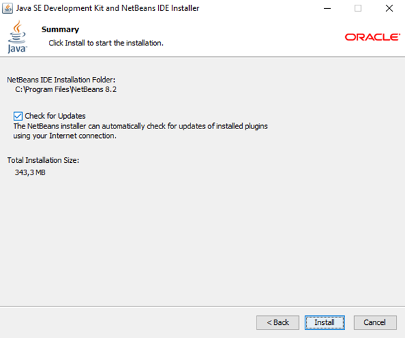
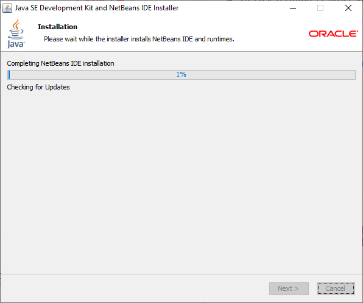

# Semana 01

Temario
- [Semana 01](#semana-01)
- [El lenguaje de programación de Java ☕](#el-lenguaje-de-programación-de-java-)
  - [El JDK Java Development Kit](#el-jdk-java-development-kit)
    - [La API Java](#la-api-java)
    - [El JRE de Java](#el-jre-de-java)
    - [Instalación de JDK](#instalación-de-jdk)
  - [El IDE NetBeans de ☕](#el-ide-netbeans-de-)
      - [Instalación de NetBeans](#instalación-de-netbeans)
    - [Prueba del IDE NetBeans junto con Java](#prueba-del-ide-netbeans-junto-con-java)
  - [Identificadores y variables](#identificadores-y-variables)
    - [Identificadores](#identificadores)
  - [Tipos de Variables](#tipos-de-variables)
  - [Declarar Variables](#declarar-variables)
    - [Variable finales o variables definitivas](#variable-finales-o-variables-definitivas)
  - [Tipos de datos no primitivos de Java](#tipos-de-datos-no-primitivos-de-java)


# El lenguaje de programación de Java ☕

Fue desarrollado por [James Gosling](https://en.wikipedia.org/wiki/James_Gosling) en 1995 como una plataforma universal que podía ejecutar la misma aplicación en cualquier máquina independiente de su sistema operativo.

Las aplicaciones de Java son compiladas a *bytecode* que puede ejecutarse en cualquier máquina virtual Java (*Java Virtual Machine* (JVM)) sin importar la arquitetucta de la computadora subyacente.

## El JDK Java Development Kit

Provee herramientas de desarrollo para la creación de programas en Java. Incluye una *interfaz de programación de aplicaciones* (API) de Java, el entorno en tiempo de ejecución de Java (*Java Runtime Environment* (JRE) y el compilador de Java.

### La API Java

La interfaz de programción de aplicaciones (*Application Programming Interface* (API)) de Java contiene las clases principales que se utilizan cuando se programa en Java. Esto ofrece la biblioteca genérica de clases que puede ser utilizada en la creación del software escrito en Java.


### El JRE de Java

El entorno en tiempo de ejecución de Java (*Java Runtime Environment*) es un conjunto de utilidades que permite ejecutar aplicaciones escritas en Java. El JRE contiene la máquina virtual Java 8Java Virtual Machine (JVM)), un conjunto de bibliotecas Java y otros componentes necesarios para poder ejecutar los programas escritos en Java. Crea los objetos en memoria que son utilizados durante la ejecución y sirve de "intermediario" entre el sistema operativo y Java.

### Instalación de JDK

- Ingrese al siguiente [LINK](https://www.oracle.com/technetwork/es/java/javase/downloads/jdk-netbeans-jsp-3413139-esa.html) y descargue los archivos.




## El IDE NetBeans de ☕
NetBeans es un IDE libre (entorno de desarrollo integrado -*Integrated Development Environment* (IDE)), diseñado principalmente para programar en el lenguaje de programación Java.

#### Instalación de NetBeans
Con el archivo descargado desde [Oracle](https://www.oracle.com/tools/technologies/netbeans-ide.html) dar click sobre este e instalarlo.





### Prueba del IDE NetBeans junto con Java

Al abrir la aplicación se debe crear un nuevo proyecto.


Una vez se crea el nuevo proyecto que en este caso es un paquete de aplicación, se debe tener en cuenta la estructura del código de Java.

**package** define el nombre del paquete.

**public** class nos define el nombre del archivo .java

**public static void main** **(String[ ] args){ }** Esta es la función principal


El siguiente código es un ejemplo para ejecutar la función de imprimir la palabra "**Hola Mundo**"

```java
package hola.mundo;

  public class HolaMundo {

    public static void main (String [ ] args){
      System.out.printIn("hola mundo");
  }
}
```
## Identificadores y variables

Existen dos tipos de lenguajes y estos dependen del **tipado** de las variables, el cual es el procedimiento por medio del cuál estas asumen su valor en la memoria.

- **Tipado estático**:Donde cada variable y expresión deben definirse de forma explícita, es decir, en el momento en que se declara una variable, se debe indicar a que tipo de dato pertenece (*e.g.* C, C++, Java)

```java
int a = 1;
String b = "Hola";
bool c = true;

func saludar() string{

}
```

- **Tipado dinámico**: En estos lenguajes las variables pueden recibir diferentes tipos de datos a lo largo del tiempo y no es necesario especificar un tipo de dato para las variables (*e.g.* Ruby, R, :snake:).

```python
a = 1
b = "Hola"
c = true

def saludar():
```

### Identificadores
Un identificador es una secuencia de símbolos que se utilizan como nombres de variables, funciones, arreglos, clases y otras estructuras de los lenguajes de programación. 

En Java se escriben como secuencias de caracteres alfanuméricos del alfabeto inglés. Aunque en Java no hay límite en la longitud del identificador, es aconsejable que tenga de 4 a 15 caracteres. Estos **NO** deben ser iguales a palabras reservadas (*e.g.* *while*), empezar con números (*e.g.* 1salon) o que tengan caractéres especiales (*e.g.* Salón).

```java
//Mal ejemplo de un identificador
1er_mes
Primer nombre
p@dre
Día
Velocidad-máxima
true
Var#1
@var

//Buen ejemplo de un identificador
E$pacio
False
Variable
```

## Tipos de Variables

Las variables son contenedores para almacenar valores de datos.

En Java, existen diferentes tipos de variables, por ejemplo:

- **String**- almacena texto, como "Hola". Los valores de cadena están entre comillas dobles
- **int**- almacena enteros (números enteros), sin decimales, como 123 o -123
- **float**- almacena números de coma flotante, con decimales, como 19.99 o -19.99
- **char**- almacena caracteres individuales, como 'a' o 'B'. Los valores de char están entre comillas simples
- **boolean**- almacena valores con dos estados: verdadero o falso

## Declarar Variables

La sintaxis de creación de una variable es sencilla, se declara el tipo de variable, el nombre de la variable y el valor de la variable, todo esto, y como cada línea en Java, debe finalizar con un **;**.

```java
tipo NombreVariable = valor;
```

### Variable finales o variables definitivas

Este tipo de variables se declaran como variables *final* lo cual le indica al lenguaje que esta variable no podrá ser reemplazada.

```java
final int myNum = 25;
myNum = 6768;  // Esto generará el siguiente error: "cannot assign a value to a final variable"
```
## Tipos de datos no primitivos de Java

Tipos de datos no primitivos

Los tipos de datos no primitivos se denominan tipos de referencia porque se refieren a objetos.

La principal diferencia entre los tipos de datos primitivos y no primitivos son:

- Los tipos primitivos están predefinidos (ya definidos) en Java. Los tipos no primitivos son creados por el programador y no están definidos por Java (excepto para String).
- Los tipos no primitivos se pueden usar para llamar a métodos para realizar ciertas operaciones, mientras que los tipos primitivos no pueden.
-  Un tipo primitivo siempre tiene un valor, mientras que los tipos no primitivos pueden ser null.
-  Un tipo primitivo comienza con una letra minúscula, mientras que los tipos no primitivos comienzan con una letra mayúscula.
- El tamaño de un tipo primitivo depende del tipo de datos, mientras que los tipos no primitivos tienen todos el mismo tamaño.

Ejemplos de tipos no primitivos son Strings , Arrays , Classes, Interface , etc. Aprenderá más sobre estos en un capítulo posterior.