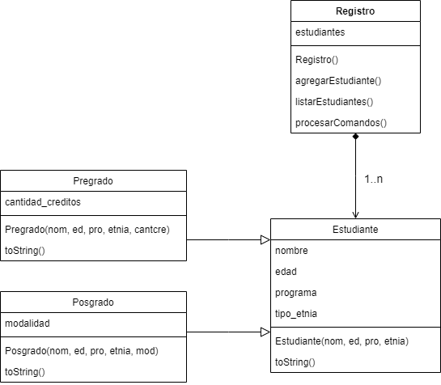

# Reto 02

## Registro de estudiantes

La Universidad Nacional de Colombia ha decidido brindarle la oportunidad de desarrollar un pequeño demo de una aplicación para el registro de estudiantes de pregrado y posgrado. Como información se tiene que todos los estudiantes poseen atributos como nombre, edad, programa en el cual realiza sus estudios y tipo de etnia (indígena, afrocolombiano, raizal, gitana o ninguna).

Los estudiantes se clasifican como de pregrado o posgrado. El estudiante de pregrado tiene como característica el número de créditos aprobados de su programa, para el estudiante de posgrado es importante almacenar la modalidad de su programa la cual puede ser de profundidad o de investigación


Considere la especificación del siguiente diagrama de clases para este reto:



### Procesar Comandos

En la clase Registro, se debe definir la función procesarComandos que realiza las siguientes operaciones:

### Agregar estudiante: Opción 1

Se puede añadir un estudiante de pregrado con el siguiente comando:

1&Pregrado&nombreEstudiante&edad&programa&etnia&creditosAprobados

Ejemplo

1&Pregrado&Luis Parra&21&Medicina&Raizal&15

Se puede añadir un estudiante de posgrado con el siguiente comando:

1&Posgrado&nombreEstudiante&edad&programa&etnia&modalidad

 Ejemplo:

1&Posgrado&María Sarmiento&25&Maestría en economía&Ninguna&Investigación

 

### Listar ítems del registro: Opción 2

Se debe mostrar la frase: “***Listado de estudiantes***” Seguida por los estudiantes en el orden en el que fueron agregados.

Si se trata de un estudiante de pregrado se mostrará así. Recuerde que \t implica correr el ítem unos espacios a la derecha:

\tEstudiante Pregrado

\tNombre: Luis Parra

\tEdad: 21 anios

\tPrograma: Medicina

\tEtnia: Raizal

\tCreditos aprobados: 15

Si se trata de un estudiante de posgrado se mostrará así:

\tEstudiante Posgrado

\tNombre: María Sarmiento

\tEdad: 25 anios

\tPrograma: Maestría en economía

\tEtnia: Ninguna

\tModalidad: Investigación


### Salir: Opción 3

Esta opción genera que la aplicación termine su ejecución.


Nota 1: Observe que el único comando que tiene salida es el listar.

Nota 2: En este ejercicio se requiere subir cuatro archivos. 

 Uno correspondiente a la clase Estudiante llamado  Estudiante.java,   otro correspondiente al Estudiante de pregrado llamado  Pregrado.java otro correspondiente al Estudiante de posgrado llamado  Posgrado.java otro correspondiente al Registros llamado Registro.java (aquí va el método main)
 Recuerde eliminar la línea de package al hacer el envío y utilizar el botón de [+] para agregar más de un archivo de código fuente.
    

 

**Entrada**

|Entrada|
|-|
|1&Posgrado&Maria Sarmiento&25&Maestria en economia&Ninguna&Investigacion|
|1&Pregrado&Luis Parra&21&Medicina&Raizal&15 |
|1&Pregrado&Martha Casas&19&Derecho&Ninguna&42 |
|1&Posgrado&Luz Salas&23&Maestria en ingenieria&Ninguna&Profundizacion|
|2|
|3|


**Salida**

|Salida|
|-|
|***Listado de estudiantes***

       Estudiante Posgrado

       Nombre: Maria Sarmiento

       Edad: 25 anios

       Programa: Maestria en economia

       Etnia: Ninguna

       Modalidad: Investigacion

       Estudiante Pregrado

       Nombre: Luis Parra

       Edad: 21 anios

       Programa: Medicina

       Etnia: Raizal

       Creditos aprobados: 15

       Estudiante Pregrado

       Nombre: Martha Casas

       Edad: 19 anios

       Programa: Derecho

       Etnia: Ninguna

       Creditos aprobados: 42

       Estudiante Posgrado

       Nombre: Luz Salas

       Edad: 23 anios

       Programa: Maestria en ingenieria

       Etnia: Ninguna

       Modalidad: Profundizacion|


## Respuesta

## Registro.java
```java
import java.util.ArrayList;
import java.util.Scanner;

/**
 *
 * @author User
 */
public class Registro {

    public ArrayList<Estudiante> estudiantes;

    public Registro() {
        this.estudiantes = new ArrayList<>();
    }

    /**
     * @param args the command line arguments
     */
    public static void main(String[] args) {
        Registro registro = new Registro();
        registro.procesarComandos();
    }

    public void procesarComandos() {
        Scanner teclado = new Scanner(System.in);

        while (true)
        {
            String comandos = teclado.nextLine();

            String[] campos = comandos.split("&");
            String opcion = campos[0];

            if (opcion.equals("1"))
            {
                String tipo = campos[1];
                String nombre = campos[2];
                int edad = Integer.parseInt(campos[3]);
                String programa = campos[4];
                String etnia = campos[5];
                String creditos_modalidad = campos[6];
                if (tipo.equals("Pregrado"))
                {
                    Pregrado pregrado = new Pregrado(Integer.parseInt(creditos_modalidad), nombre, edad, programa, etnia);
                    this.agregarEstudiante(pregrado);
                } else if (tipo.equals("Posgrado"))
                {
                    Posgrado posgrado = new Posgrado(creditos_modalidad, nombre, edad, programa, etnia);
                    this.agregarEstudiante(posgrado);
                }

            } else if (opcion.equals("2"))
            {
                listarEstudiantes();
            } else if (opcion.equals("3"))
            {
                break;
            }
        }

    }

    public void agregarEstudiante(Estudiante estudiante) {
        this.estudiantes.add(estudiante);
    }
    
    public void listarEstudiantes() {
//        for (int i = 0; i < this.estudiantes.size(); i++) {
//            
//        }
          System.out.println("***Listado de estudiantes***");
          for (Estudiante e:this.estudiantes){
              System.out.println(e.toString());
          }
    }

}
```
## Pregrado.java

```java
public class Pregrado extends Estudiante{
    public int cantidad_creditos;

    public Pregrado(int cantidad_creditos, String nombre, int edad, String programa, String tipo_etnia) {
        super(nombre, edad, programa, tipo_etnia);
        this.cantidad_creditos = cantidad_creditos;
    }
    
    public String toString() {
        String texto = "\tEstudiante Pregrado" + "\n" +
                "\tNombre: " + this.nombre + "\n" + 
                "\tEdad: " + this.edad + " anios" + "\n" +
                "\tPrograma: " + this.programa + "\n" + 
                "\tEtnia: " + this.tipo_etnia + "\n" + 
                "\tCreditos aprobados: " + this.cantidad_creditos;
        return texto;
    }
    
}
```

## Posgrado.java

```java
public class Posgrado extends Estudiante{
    public String modalidad;

    public Posgrado(String modalidad, String nombre, int edad, String programa, String tipo_etnia) {
        super(nombre, edad, programa, tipo_etnia);
        this.modalidad = modalidad;
    }
    
    public String toString() {
        String texto = "\tEstudiante Posgrado" + "\n" +
                "\tNombre: " + this.nombre + "\n" + 
                "\tEdad: " + this.edad + " anios" + "\n" +
                "\tPrograma: " + this.programa + "\n" + 
                "\tEtnia: " + this.tipo_etnia + "\n" + 
                "\tModalidad: " + this.modalidad;
        return texto;
    }
    
    
}

```

## Estudiante.
```java
public class Estudiante {
    public String nombre;
    public int edad;
    public String programa;
    public String tipo_etnia;

    public Estudiante(String nombre, int edad, String programa, String tipo_etnia) {
        this.nombre = nombre;
        this.edad = edad;
        this.programa = programa;
        this.tipo_etnia = tipo_etnia;
    }    
}
```